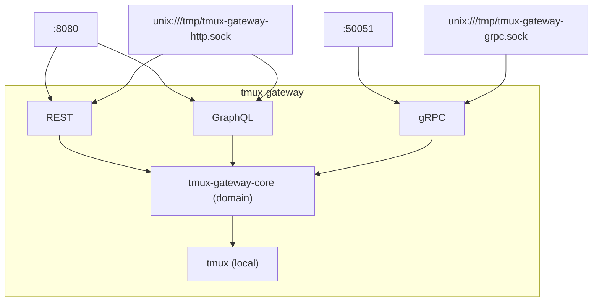

# tmux-gateway

A Rust server that exposes a unified interface for interacting with your local [tmux](https://github.com/tmux/tmux) sessions through multiple API protocols — all from a single process.

## Why?

Managing tmux programmatically typically means shelling out to `tmux` commands and parsing text output. tmux-gateway wraps that complexity behind three well-defined API layers so any client — CLI tool, web dashboard, IDE plugin, or automation script — can interact with tmux using the protocol that fits best.

Every API layer is **type-safe by design** — clients can generate fully typed bindings from the source-of-truth schema for their protocol:

| Protocol  | Schema artifact                            | Client codegen                                          |
| --------- | ------------------------------------------ | ------------------------------------------------------- |
| gRPC      | `.proto` files                             | `protoc` / `buf` generates typed stubs for any language |
| GraphQL   | Introspection / exported `.graphql` schema | `graphql-codegen`, Relay, Apollo, etc.                  |
| REST      | `openapi.json` (OpenAPI spec)              | `openapi-generator`, `orval`, `oapi-codegen`, etc.      |
| WebSocket | `asyncapi.json` (AsyncAPI 3.0 spec)        | `asyncapi-codegen`, custom generators, etc.             |

No hand-written DTOs on the client side — pick your protocol, point your code generator at the schema, and get compile-time guarantees end to end.

## Architecture



| Protocol  | Default Port | Unix Socket                   | Use case                                                               |
| --------- | ------------ | ----------------------------- | ---------------------------------------------------------------------- |
| REST      | 8080         | `/tmp/tmux-gateway-http.sock` | Simple integrations, curl, scripts                                     |
| GraphQL   | 8080         | `/tmp/tmux-gateway-http.sock` | Flexible queries, web UIs (includes GraphiQL playground at `/graphql`) |
| WebSocket | 8080         | `/tmp/tmux-gateway-http.sock` | Real-time pane streaming (`/ws/pane/{target}`)                         |
| gRPC      | 50051        | `/tmp/tmux-gateway-grpc.sock` | High-performance, typed clients, service-to-service                    |

## Getting Started

### Prerequisites

- **Rust** (edition 2024) — install via [rustup](https://rustup.rs/)
- **tmux** — `brew install tmux` / `apt install tmux`
- **protoc** — Protocol Buffers compiler (`brew install protobuf` / `apt install protobuf-compiler`)

### Build & Run

```bash
cp .env.example .env   # set required HTTP_PORT / GRPC_PORT (and other options)
make build             # compiles + exports schemas to schemas/
cargo run
```

`HTTP_PORT` and `GRPC_PORT` are required — the server's preflight checks
(`src/preflight.rs`) exit with an error if they are unset.

### Testing & Validation

```bash
make test    # run workspace tests
make lint    # cargo fmt check + clippy
make check   # full pre-push validation suite (lint, test, doc, deny, audit, machete, cspell)
```

### Docker

Run everything with Docker Compose:

```bash
make docker-up    # builds and starts tmux-gateway + grpcui
make docker-down  # stops and removes containers
```

This starts:

- **tmux-gateway** on ports `8080` (HTTP) and `50051` (gRPC), with a health check on `/health`
- **grpcui** on port `9090` for interactive gRPC exploration

Configure ports and settings via `.env`.

The `make build` command compiles the project and generates all API schema files (`schemas/openapi.json`, `schemas/schema.graphql`, `schemas/tmux_gateway.proto`, `schemas/asyncapi.json`) — the proto is code-generated from Rust macros, not hand-maintained.

The server starts two listeners (each available over TCP and optionally a Unix socket):

- **HTTP** (REST + GraphQL) on `http://localhost:8080` and `unix:///tmp/tmux-gateway-http.sock`
- **gRPC** on `localhost:50051` and `unix:///tmp/tmux-gateway-grpc.sock`

### Configuration

| Variable                    | Description                                                     | Default             |
| --------------------------- | ---------------------------------------------------------------- | ------------------- |
| `HTTP_PORT`                 | HTTP server port (required)                                       | —                   |
| `GRPC_PORT`                 | gRPC server port (required)                                       | —                   |
| `RUST_LOG`                  | Logging filter                                                    | —                   |
| `RUST_LOG_FORMAT`           | Set to `json` for JSON-formatted logs                              | plain text          |
| `HTTP_SOCKET`                | Unix socket path for HTTP server (empty = disabled)                | —                   |
| `GRPC_SOCKET`                | Unix socket path for gRPC server (empty = disabled)                | —                   |
| `SHUTDOWN_TIMEOUT_SECS`      | Graceful shutdown timeout in seconds                                | `30`                |
| `TMUX_COMMAND_TIMEOUT_SECS`  | Timeout for individual tmux commands in seconds                    | `30`                |
| `CORS_ORIGINS`               | Comma-separated allowed CORS origins                                | `http://localhost:3000,http://localhost:<HTTP_PORT>` |
| `MAX_REQUEST_BODY_BYTES`     | Max HTTP request body size in bytes                                 | `1048576` (1 MB)    |
| `RATE_LIMIT_RPS`             | Default per-IP rate limit (requests/sec)                            | `100`               |
| `RATE_LIMIT_READ_RPS`        | Per-IP rate limit for read operations                               | value of `RATE_LIMIT_RPS` |
| `RATE_LIMIT_WRITE_RPS`       | Per-IP rate limit for write operations                              | value of `RATE_LIMIT_RPS` |
| `GRAPHQL_MAX_DEPTH`          | Max GraphQL query depth                                             | `15`                |
| `GRAPHQL_MAX_COMPLEXITY`     | Max GraphQL query complexity                                        | `500`               |
| `GRAPHQL_INTROSPECTION`      | Set to `false` to disable GraphQL introspection                     | `true`              |

```bash
RUST_LOG=tmux_gateway=debug cargo run

# Enable Unix sockets
HTTP_SOCKET=/tmp/tmux-gateway-http.sock GRPC_SOCKET=/tmp/tmux-gateway-grpc.sock cargo run
```

## API Quick Reference

### REST

```bash
# Health check
curl http://localhost:8080/health

# List tmux sessions
curl http://localhost:8080/ls
```

Via Unix socket:

```bash
curl --unix-socket /tmp/tmux-gateway-http.sock http://localhost/health
curl --unix-socket /tmp/tmux-gateway-http.sock http://localhost/ls
```

Full Swagger UI available at `http://localhost:8080/swagger-ui`.

### GraphQL

Open the interactive GraphiQL playground at `http://localhost:8080/graphql`, or query directly:

```bash
curl -X POST http://localhost:8080/graphql \
  -H "Content-Type: application/json" \
  -d '{"query": "{ sessions { name windows created attached } }"}'
```

Via Unix socket:

```bash
curl --unix-socket /tmp/tmux-gateway-http.sock -X POST http://localhost/graphql \
  -H "Content-Type: application/json" \
  -d '{"query": "{ sessions { name windows created attached } }"}'
```

### WebSocket

Stream live pane output over WebSocket:

```
ws://localhost:8080/ws/pane/{session}:{window}
```

Optional query parameter: `?interval_ms=500` (polling interval in ms, default 500, minimum 100).

The server sends a text message whenever the pane content changes — no messages are sent when idle. The connection is receive-only; the only client message the server handles is a close frame.

To test interactively, use [Hoppscotch](https://hoppscotch.io/realtime/websocket) or any WebSocket client:

```bash
# Using websocat
websocat ws://localhost:8080/ws/pane/my-session:my-window

# With a custom interval
websocat "ws://localhost:8080/ws/pane/my-session:my-window?interval_ms=200"
```

GraphQL subscriptions are also available over WebSocket at `/graphql/ws` (see the GraphiQL playground).

### gRPC

Using [grpcurl](https://github.com/fullstorydev/grpcurl):

```bash
# Health check
grpcurl -plaintext localhost:50051 grpc.health.v1.Health/Check

# List tmux sessions
grpcurl -plaintext localhost:50051 tmux_gateway.TmuxGateway/Ls
```

Via Unix socket:

```bash
grpcurl -plaintext -unix /tmp/tmux-gateway-grpc.sock grpc.health.v1.Health/Check
grpcurl -plaintext -unix /tmp/tmux-gateway-grpc.sock tmux_gateway.TmuxGateway/Ls
```

## Project Structure

```
tmux-gateway/
├── schemas/                    # API schema definitions (all generated by `make build`)
│   ├── tmux_gateway.proto      # gRPC — code-generated from Rust macros
│   ├── openapi.json            # REST — generated from Axum/utoipa definitions
│   ├── schema.graphql          # GraphQL — generated from async-graphql schema
│   └── asyncapi.json           # WebSocket/async — generated from Rust definitions
├── crates/
│   └── tmux-gateway-core/      # Domain logic — tmux command wrappers
├── src/
│   ├── lib.rs             # Shared library (re-exports modules)
│   ├── main.rs            # Entrypoint — spawns HTTP & gRPC servers
│   ├── bin/
│   │   └── export_schemas.rs  # Generates openapi.json & schema.graphql
│   ├── api/               # Network API layers
│   │   ├── rest/          # Axum REST routes + OpenAPI definitions
│   │   ├── graphql/       # async-graphql schema & handler
│   │   └── grpc/          # tonic gRPC service (code-first via macros)
│   └── export_schemas.rs  # Schema export logic
├── tests/                 # Integration & e2e tests
├── Makefile               # Build orchestration (cargo build + schema export)
└── Cargo.toml
```

## Tech Stack

- [Axum](https://github.com/tokio-rs/axum) — HTTP framework (REST + GraphQL serving)
- [async-graphql](https://github.com/async-graphql/async-graphql) — GraphQL server
- [Tonic](https://github.com/hyperium/tonic) — gRPC framework
- [Tokio](https://tokio.rs/) — Async runtime
- [Prost](https://github.com/tokio-rs/prost) — Protobuf serialization

## Related projects

[moadim](https://moadim.io/) — loop engineering: build, schedule & run agent loops.

## License

MIT
